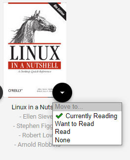
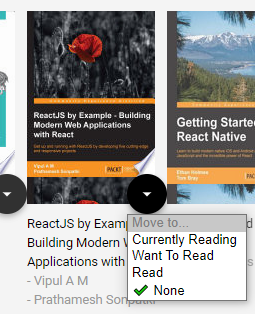

# MyReads Project

To get started:

* install all project dependencies with `npm install`
* start the development server with `npm start`

## What You're Getting
```
"bash"

│   .gitignore
│   package-lock.json
│   package.json
│   README.md
│   SEARCH_TERMS.md
│   yarn.lock
│
├───public
│       favicon.ico
│       index.html
│
└───src
    │   App.css
    │   App.js
    │   App.test.js
    │   BooksAPI.js
    │   index.css
    │   index.js
    │
    ├───components
    │   │   Home.js
    │   │   Search.js
    │   │
    │   └───shelvs
    │           CurrentlyReading.js
    │           Read.js
    │           WantToRead.js
    │
    └───icons
            add.svg
            arrow-back.svg
            arrow-drop-down.svg
```
## Project description 

* It's a Book tracking App to save your `currently Reading Books` , `Want to Read` and `read` Books, You can also search for new book in the provided Udacity's Books Library API with a huge variety of Books and topics 

## Project Functionality

* Store Your Books in the home screen's shelves and Move them around as you Like through the drop down menu on the bottom right on every book, or by clicking on `none` option you can remove the book from the shelves


* By clicking on the Plus(+) sign on the right bottom corner of your screen you will directed to the search page where you type name of the book or the topic you want to search for and you will be presented with top 20 of the most matched Books
> check the SEARCH_TERMS.md for search topics

* In the search Page you can add any Book from the search results by choosing a shelf from the drop down menu on the bottom right on every book



